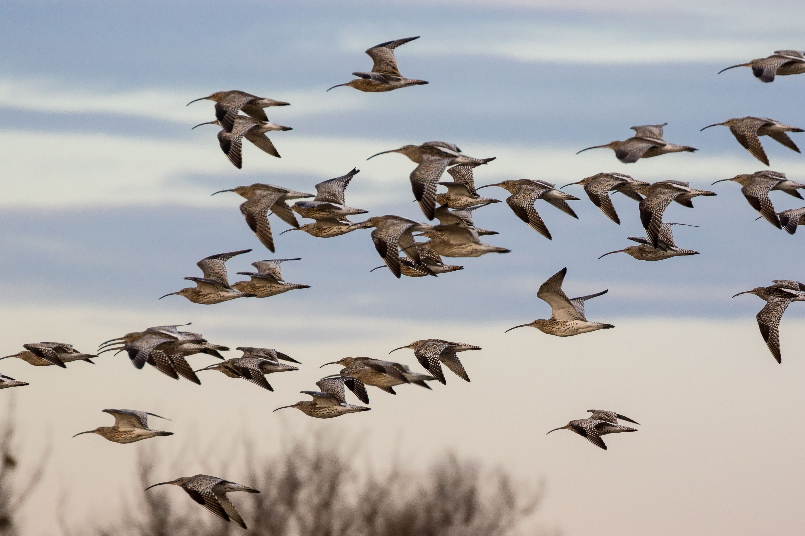
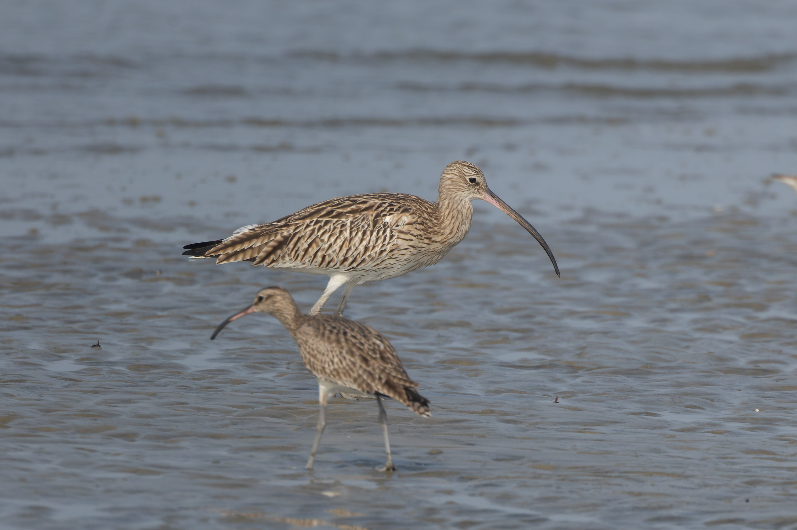
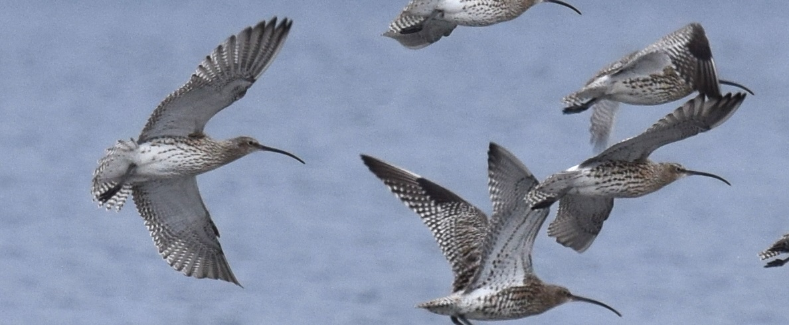
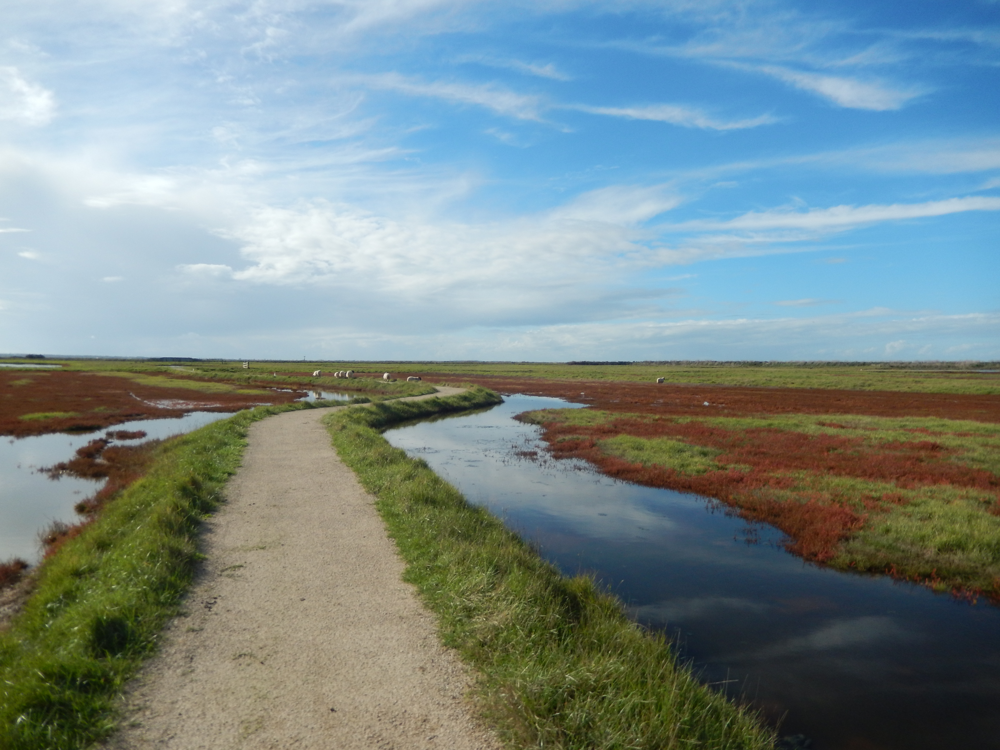
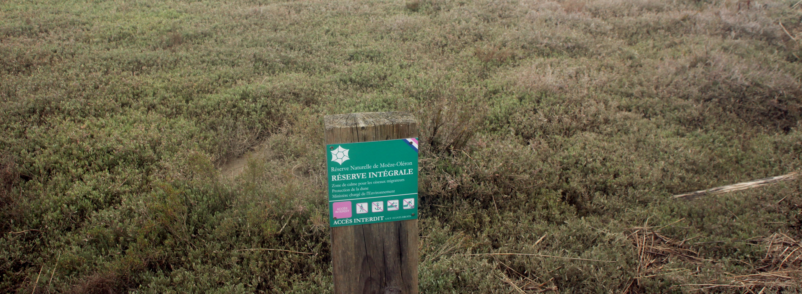

```{r}
#| include: false

# self-contained: true

rm(list = ls()) # Nettoyage de l'environnement

## Packages --------------------------------------------------------------------
# Choix automatique (par défaut, rapide)
options(repos = c(CRAN = "https://cloud.r-project.org"))

library(tidyverse)
library(viridis)
library(readxl)
library(htmltools)
library(sf)
library(readxl)
library(DT)
library(dplyr)

## time zone -------------------------------------------------------------------

with_tz(Sys.time(), "Europe/Paris")

## Palette ---------------------------------------------------------------------

palette_viri <- viridis::viridis(10, begin = 0, end = 1, direction = 1, option = "plasma")

## Chemins de données ----------------------------------------------------------

data_path <- "D:/Projets_Suzanne/Courlis/3) Data/1) data/"
data_generated_path <- "D:/Projets_Suzanne/Courlis/3) Data/2) data_generated/"
data_image_path <- "D:/Projets_Suzanne/Courlis/3) Data/3) images/"
data_view_map_path <- "D:/Projets_Suzanne/Courlis/3) Data/4) view_map/"
atlas_path <- "D:/Projets_Suzanne/Courlis/Atlas_Courlis"
```

# **Contexte**

```{=html}

```

::: {style="font-size: 0.5em; color: #aaa; text-align: right; margin-top: -10px;"}
Crédit photo : JoachimKohlerBremen (Wikimedia Commons)
:::

## Objectifs scientifiques et techniques

Depuis 2015, la Ligue pour la Protection des Oiseaux (LPO-France), en collaboration avec les laboratoires LIttoral ENvironnement et Sociétés (LIENSs, UMR 7266, CNRS - Université de La Rochelle) et le Centre d'Écologie et des Sciences de la Conservation (CESCO, UMR 7204, CNRS - MNHN - Sorbonne Université), bague et équipe de GPS des Courlis cendré au sein de la Réserve Naturelle Nationale de Moëze-Oléron (@fig-Photo_intro).

L’objectif général de cette étude est de mieux comprendre l’utilisation de l’espace par ces oiseaux dans un site fonctionnel comprenant le bassin de Marennes et le marais de Brouage (@fig-zone_map_new). Cette recherche s’inscrit dans un contexte de recul du trait de côte, entraînant une maritimisation progressive de la réserve naturelle, et de fortes pressions anthropiques (chasse, pêche à pied, ostréiculture). Il s’agit d’identifier et de proposer des zones prioritaires à préserver pour l’accueil des limicoles.

::: {#fig-Photo_intro}
```{r}
#| echo: false
knitr::include_graphics("Photo_intro.png", dpi = 100)
```

Courlis cendré (a), Equipement GPS d'un courlis cendré (b), Survol drone de la réserve naturelle nationale de Moëze-Oléron côté continent (c, crédit photos : Armel Deniau/LPO, Loic Jomat/LPO, Romain Beaubert/LPO).
:::

À partir de l’analyse des données issues de balises GPS posées sur plusieurs dizaines de courlis cendrés dans la réserve, l’objectif principal est de produire un atlas dynamique décrivant l’usage de l’espace par ces oiseaux, en lien avec les activités humaines et les effets de la maritimisation.

Le travail présenté ici propose une cartographie fine de la répartition des courlis dans le site fonctionnel de la réserve de Moëze-Oléron en fonction des fluctuations environnementales et des perturbations anthropiques détectées et mesurables sur la zone.

Cette étude s’inscrit dans le cadre du projet "Adaptation des limicoles aux changements climatiques", financé par l’Etat (Fonds Vert) et la Région Nouvelle-Aquitaine (Fonds Européen de Développement Régional).

::: {.logo-line style="display:flex; justify-content:center; align-items:center; gap:1000px; margin-top:20px;"}


:::

<a href="#top">↑ retour en haut</a>

## Le courlis cendré

### Morphologie

Le Courlis cendré (<em>Numenius arquata</em>) est le plus grand limicole d’Europe. Longueur : 55–65 cm. Envergure : 90–110 cm. Poids : 600–1200 g. Plumage brun-gris tacheté, bec long (jusqu’à 19 cm), courbé vers le bas. Dimorphisme sexuel marqué ; la femelle est généralement plus grande avec un bec plus long.

### Comportement général

Espèce discrète, au comportement prudent. Territorial en période de reproduction, grégaire en dehors de celle-ci. Chant flûté, ascendant et mélancolique, souvent émis en vol.

### Régime alimentaire

Régime invertivore dominant : vers de terre, insectes, mollusques, crustacés. Complété ponctuellement par des graines et baies. Alimentation au sol ou par sondage dans la vase ou les prairies humides. Habitat

-   Habitat de reproduction : prairies humides, landes, tourbières, marais, zones agricoles extensives.
-   Habitat d’alimentation : vasières intertidales, estuaires, prés salés, prairies humides, pâtures.
-   Habitat de repos (hors reproduction) : vasières, zones littorales, lagunes, marais salants.

### Saison de reproduction

Avril à juillet. Nid au sol, souvent dissimulé dans la végétation. Ponte de 3–4 œufs. Incubation \~28 jours. Émancipation des jeunes vers 5–6 semaines.

### Migration

Migrateur partiel. Les populations du nord-est de l’Europe hivernent principalement en Europe occidentale et sur les côtes atlantiques africaines. En France, présence à l’année dans certaines régions littorales (ex. : Baie de Somme, estuaire de la Loire), migration marquée en automne et au printemps.

### Effectifs de population

Population mondiale : estimée à 140 000 – 240 000 couples reproducteurs (équivalent à environ 280 000 – 480 000 individus matures).

Population européenne : estimée à 97 000 – 167 000 couples (BirdLife International, 2021).

Population française :

-   Nicheurs : 2 200 à 2 800 couples (principalement dans le nord-ouest, Centre-Val de Loire, Grand Est).
-   Hivernants : 20 000 à 30 000 individus, surtout sur le littoral atlantique et dans le sud-est.

Tendance : déclin modéré à marqué en Europe occidentale. Fort recul des effectifs nicheurs en France depuis les années 1980 (perte estimée à plus de 30 %).

### Statuts de conservation

IUCN : Near Threatened (Quasi menacé) à l’échelle mondiale.

Europe : Annexe II de la Convention de Berne. Déclin confirmé dans plusieurs États membres.

France : Vulnérable. Espèce inscrite à l’arrêté ministériel du 26 juin 1987 fixant la liste des espèces de gibier dont la chasse est autorisée mais bénéficiant actuellement d’un moratoire de suspension de la chasse reconduit chaque année.

International : Annexe II de la Convention de Bonn (CMS). Annexe II.2 de la Directive Oiseaux (espèce chassable sous conditions).

<a href="#top">↑ retour en haut</a>

# **Analyses spatiales**

```{=html}

```

::: {style="font-size: 0.5em; color: #aaa; text-align: right; margin-top: -10px;"}
Crédit photo : Tisha Mukherjee (Wikimedia Commons)
:::

Le détail des méthodes est disponible dans le document [Readme]{style="font-family: 'Courier';"} du projet.

## La zone d'étude

```{r}
#| include: false
BOX <- sf::st_read(paste0(data_generated_path, "BOX.gpkg"))
area_box <- sf::st_area(BOX)
area_box_km <- as.numeric((round(area_box / 1000000, 1)))
```

La zone d'étude (voir @fig-zone_map_new) est un rectangle de `r area_box_km` km² qui s'étend :

-   au Nord jusqu'à l'estuaire de la Charente,
-   à l'Est jusqu'à la limite Est de la ville de Rochefort,
-   au Sud jusqu'à l'estuaire de la Seudre,
-   et à l'Ouest jusqu'à la facade Est de l'ile d'Oléron, englobant ainsi zone fonctionnelle du bassin de Marennes, la réserve de Moëze-Oléron et le marais de Brouage.

Les études sur la zone globale ont été effectuées avec un grain spatial large en grille de 100 m x 100 m. Les études sur les zones réduites A, B et C ont été effectués avec un grain spatial fin en grille de 10 m x 10 m.

::: {#fig-zone_map_new}
```{r}
#| echo: false

tags$iframe(
  src = "zone_map_new.html",
  width = "100%",
  height = "400px"
)
```

Zones d'études - zone d'étude globale (zone blanche) et zones d'études réduites (zones A, B, C)
:::

## Les données GPS utilisées

### Nettoyage des données GPS

Le nettoyage des données issues des balises GPS a principalement été effectué à l'aide du package R adehabitat [Calenge (2006)](#calenge2006).

En résumé, les points utilisés pour déterminer les comportements d’alimentation et de repos sont stationnaire (vitesse inférieure ou égale à 0.5 km/h). Pour que chaque individu ait le même poids dans les analyses, un point toutes les 5 min a été estimé pour chaque individus. Uniquement les points situés dans la zone d’étude ont été utilisés. Le temps entre chaque point de localisation sauvegardé par individu pouvant varier et provoquer des périodes de carences de données plus ou moins longues, les périodes où la balise GPS de l’oiseau a enregistré plus d’un point par période de 5 min ont été analysés (éviter d’analyser des positions GPS trop peu précises et de résolutions temporelles hétérogènes). Une limite basse de 100 points estimés par individus sur une période supérieure à 28 jours (deux cycles lunaires) a été appliquée pour maintenir une très haute qualité de suivi des individus pour les analyses.

### Taille des jeux de données analysés

Taille du jeu de données brut :

-   Nombre d'individu : 99
-   Nombre de point GPS enregistrés : 5 230 178

Taille du jeu de données dans la zone d'étude :

-   Nombre d'individu : 83
-   Nombre de point GPS enregistrés : 3 138 014

```{r}
#| eval: false
#| include: false
data_generated_path <- "D:/Projets_Suzanne/Courlis/3) Data/2) data_generated/"
GPS <- st_read(file.path(data_generated_path, "GPS_clean.gpkg"))

GPS$y_m_d <- ymd(as.Date(GPS$datetime))
```

```{r}
#| eval: false
#| include: false

nb_point <- length(GPS$ID)

nb_ind <- length(unique(GPS$ID))

min_year <- min(GPS$year)
max_year <- max(GPS$year)

age_dt_point <- as.data.frame(table(GPS$age))

age_dt_ind <- GPS %>%
  dplyr::select(ID, age) %>%
  distinct() %>%
  group_by(age) %>%
  summarise(n = n())

sexe_dt <- GPS %>%
  dplyr::select(ID, sex) %>%
  distinct() %>%
  group_by(sex) %>%
  summarise(n = n())

# texte à ajouter dans quarto quand propore :

# Taille du jeu de données final utilisé (après nettoyage et filtration des données) :
#
# - La période de suivi court de `r min_year` à `r max_year`
# - Nombre d'individu : 46
# - Nombre de point GPS enregistrés : 406 687
# - Nombre de femme : 7 (`r sexe_dt$n[1]` points GPS), nombre de mâle : 7 (`r sexe_dt$n[2]` points GPS)
# - Nombre de juvéniles : 7 (`r age_dt_ind$n[2]` points GPS), nombre d'adulte : 18 (`r age_dt_point$Freq[1]` points GPS)
```

## Période d'émission des balises GPS

::: {#fig-emission_plot}
```{r}
#| echo: false
#| out.width: 90%
#| fig-align: "center"
knitr::include_graphics("emission_plot.png", dpi = 100)
```

Période d'émission des balises GPS pour les individus étudiés.
:::

## Temps passé dans la réserve naturelle de Moëze-Oléron

Le temps passé dans la réserve est estimé comme le nombre de point GPS observés dans et hors réserve pour chaque individu. Chaque point représente 5 min de temps.

Pourcentage moyen de temps passé dans la réserve pour :

-   les comportements de repos : 0.597 %
-   les comportements d'alimentation : 0.631 %
-   tous autres comportements : 0.619 %
-   tous les comportements réunis : 0.610 %

::: {#fig-duree_dans_reserve_plot}
```{r}
#| echo: false
#| out.width: 70%
#| fig-align: "center"
knitr::include_graphics("duree_dans_reserve_plot.png", dpi = 100)
```

Temps passé dans la réserve de Moëze-Oléron pour chaque individu (points) en fonction du type de comportement. En lignes, les pourcentages moyens pour chaque comportement.
:::

## Domaines vitaux au sein de la réserve de Moëze-Oléron

La distribution d'utilisation (<em>Utilization Distribution</em>, ou "UD") est une fonction mathématique (une densité de probabilité) qui décrit la probabilité de présence d’un individu dans son environnement en fonction des points GPS qui lui ont été associés (Worton, 1995). Elle permet donc d’estimer les zones les plus fréquemment utilisées par un animal.

Les distributions d'utilisation de l'espace ont été estimé par la méthode dite du noyau (kernel), qui consiste à lisser les localisations individuelles afin de produire une carte continue de l’utilisation de l’espace. L’estimation par noyau repose sur un paramètre de lissage (<em>bandwidth</em>, nommé h), ici calculé selon la [règle de Silverman](https://fr.wikipedia.org/wiki/Estimation_par_noyau), ajustée par un facteur de 1/2 (h/2) pour permettre des analyses à grain plus fin.

Les domaines vitaux (<em>home range</em>) ont ici été estimés (@fig-UDMap_HR_ID) à l’aide des fonctions [kernelUD]{style="font-family: 'Courier';"} et [getverticeshr]{style="font-family: 'Courier';"} du package "adehabitatHR" [Calenge (2006)](#calenge2006).

Les calculs ont été réalisés à partir de l’ensemble des points de localisation disponibles pour chaque individu, tous comportements confondus.

Deux niveaux de domaine vital sont définis pour chaque individu : - Le domaine vital étendu (à 95%) correspondant à l’enveloppe englobant 95 % de la surface d’utilisation - Le noyau d’activité (à 50%) représentant les zones de fréquentation la plus intense

::: {#fig-UDMap_HR_ID}
```{r}
#| echo: false

tags$iframe(
  src = "UDMap_HR_ID.html",
  width = "100%",
  height = "400px"
)
```

Domaine vital à 95% (ligne) et à 50% (couleur pleine).
:::

Aire (en m²) des domaines vitaux individuels estimés à 95% (ronds oranges) et 50% (triangles verts) et pourcentage situés dans la réserve naturelle de Moëze-Oléron (gradients de couleurs, @fig-area_hr_plot).

::: {#fig-area_hr_plot}
```{r}
#| echo: false
#| out.width: 70%
#| fig-align: "center"
knitr::include_graphics("area_hr_plot.png", dpi = 100)
```

Aire du domaine vital individuel à 95% (ronds oranges) ou 50% (triangles verts). Moyenne (lignes pleines) +/- écart-type (lignes pointillés). Pourcentage de chevauchement avec la réserve en couleurs.
:::

Aire (en m²) du domaine vital des individus en fonction de leur âge ou de leur sexe.

::: {#fig-surface_sex_age_all_plot}
```{r}
#| echo: false
#| out.width: 70%
#| fig-align: "center"
knitr::include_graphics("surface_sex_age_all_plot.png", dpi = 100)
```

Aire du domaine vital des individus à 95% et 50% en fonction de leur âge ou de leur sexe.
:::

## Les principaux reposoirs

```{=html}

```

<p style="font-size: 0.8em; color: lightgray; text-align: right; margin-top: 0;">

Crédit photo : Idaho69 (Wikimedia Commons)

</p>

Le comportement de repos est défini comme un point GPS d'une vitesse de déplacement inférieure ou égale à 0.5 Km/h et entre 2h avant et 2h après la marée hautes. La vitesse de déplacement pour chaque point GPS a été estimé par partir de la fonction [speedfilter]{style="font-family: 'Courier';"} du package "adehabitatHR".

Pour les deux méthodes, les reposoirs sont identifiés à l'aide de la fonction [kernelUD]{style="font-family: 'Courier';"} du package "adehabitatHR" [Calenge (2006)](#calenge2006).

Verticle à 95% et 50%

test téléchangement carte png 

::: {#fig-UDMap_kud_roosting_A}

```{r}
#| echo: false
library(htmltools)

div(
  style = "display: flex; gap: 10px; align-items: flex-start;",

  # Carte dynamique
  div(
    style = "flex: 1;",
    tags$iframe(
      id = "map-iframe-roosting-a",
      src = "UDMap_kud_roosting_A.html",
      width = "100%",
      height = "400px",
      style = "border: none;"
    )
  ),

  # Bouton de téléchargement
  div(
    style = "padding-top: 10px;",
    tags$button(
      id = "download-btn-roosting-a",
      class = "btn btn-primary",
      style = "padding: 8px 16px; cursor: pointer;",
      HTML("&#128229; T&eacute;l&eacute;charger PNG")
    )
  )
)

# Charger les bibliothèques nécessaires
tags$script(src = "https://cdnjs.cloudflare.com/ajax/libs/dom-to-image/2.6.0/dom-to-image.min.js")

# Script JavaScript
tags$script(HTML("
(function() {
  document.getElementById('download-btn-roosting-a').addEventListener('click', function() {
    var iframe = document.getElementById('map-iframe-roosting-a');
    var button = this;

    button.disabled = true;
    button.textContent = 'Generation...';

    function waitForLib() {
      if (typeof domtoimage !== 'undefined') {
        captureIframe();
      } else {
        setTimeout(waitForLib, 100);
      }
    }

    function captureIframe() {
      try {
        var iframeDoc = iframe.contentDocument || iframe.contentWindow.document;
        var iframeBody = iframeDoc.body;

        domtoimage.toBlob(iframeBody, {
          width: iframe.offsetWidth,
          height: iframe.offsetHeight,
          style: {
            transform: 'scale(1)',
            transformOrigin: 'top left'
          }
        })
        .then(function(blob) {
          var url = URL.createObjectURL(blob);
          var a = document.createElement('a');
          a.href = url;
          a.download = 'UDMap_kud_roosting_A.png';
          a.click();
          URL.revokeObjectURL(url);

          button.disabled = false;
          button.innerHTML = '&#128229; T&eacute;l&eacute;charger PNG';
        })
        .catch(function(error) {
          console.error('Erreur de capture:', error);
          window.open(iframe.src, '_blank');
          alert('Capture automatique impossible. Carte ouverte dans nouvel onglet. Utilisez outil de capture navigateur.');
          button.disabled = false;
          button.innerHTML = '&#128229; T&eacute;l&eacute;charger PNG';
        });

      } catch (e) {
        console.error('Erreur CORS:', e);
        window.open(iframe.src, '_blank');
        alert('Restrictions de securite. Carte ouverte dans nouvel onglet. Utilisez outil de capture.');
        button.disabled = false;
        button.innerHTML = '&#128229; T&eacute;l&eacute;charger PNG';
      }
    }

    waitForLib();
  });
})();
"))
```

Reposoirs zone A

:::

:::::: panel-tabset
### Zone A

::: {#fig-UDMap_kud_roosting_A}
```{r}
#| echo: false

tags$iframe(
  src = "UDMap_kud_roosting_A.html",
  width = "100%",
  height = "400px"
)
```

Reposoirs zone A
:::

### Zone B

::: {#fig-UDMap_kud_roosting_B}
```{r}
#| echo: false

tags$iframe(
  src = "UDMap_kud_roosting_B.html",
  width = "100%",
  height = "400px"
)
```

Reposoirs zone B
:::

### Zone C

::: {#fig-UDMap_kud_roosting_C}
```{r}
#| echo: false

tags$iframe(
  src = "UDMap_kud_roosting_C.html",
  width = "100%",
  height = "400px"
)
```

Reposoirs zone C
:::
::::::

### Reposoir en fonction du mois de l'année

:::::::: panel-tabset
### Zone A

::: {#fig-UDMap_kud_roosting_month_label_A}
```{r}
#| echo: false

tags$iframe(
  src = "UDMap_kud_roosting_month_label_A.html",
  width = "100%",
  height = "400px"
)
```

Reposoirs zone A en fonction du mois
:::

### Zone B

::: {#fig-UDMap_kud_roosting_month_label_B}
```{r}
#| echo: false

tags$iframe(
  src = "UDMap_kud_roosting_month_label_B.html",
  width = "100%",
  height = "400px"
)
```

Reposoirs zone B en fonction du mois
:::

### Zone C

::: {#fig-UDMap_kud_roosting_month_label_C}
```{r}
#| echo: false

tags$iframe(
  src = "UDMap_kud_roosting_month_label_C.html",
  width = "100%",
  height = "400px"
)
```

Reposoirs zone C en fonction du mois
:::
::::::::

### Reposoir en fonction de l'age

L'âge des individus est déterminé au baguage grâce au plumage des individus. Les individus juvéniles lors du baguage et de la pose du GPS deviennent adultes après le 1er septembre de l'année suivante.

:::::::: panel-tabset
### Zone A

::: {#fig-UDMap_kud_roosting_age_A}
```{r}
#| echo: false

tags$iframe(
  src = "UDMap_kud_roosting_age_A.html",
  width = "100%",
  height = "400px"
)
```

Reposoirs zone A en fonction de l'âge
:::

### Zone B

::: {#fig-UDMap_kud_roosting_age_B}
```{r}
#| echo: false

tags$iframe(
  src = "UDMap_kud_roosting_age_B.html",
  width = "100%",
  height = "400px"
)
```

Reposoirs zone B en fonction de l'âge
:::

### Zone C

::: {#fig-UDMap_kud_roosting_age_C}
```{r}
#| echo: false

tags$iframe(
  src = "UDMap_kud_roosting_age_C.html",
  width = "100%",
  height = "400px"
)
```

Reposoirs zone C en fonction de l'âge
:::
::::::::

### Reposoir en fonction du sexe

Le sexe des individus a été déterminé lors de la pose des GPS.

:::::::: panel-tabset
### Zone A

::: {#fig-UDMap_kud_roosting_sex_A}
```{r}
#| echo: false

tags$iframe(
  src = "UDMap_kud_roosting_sex_A.html",
  width = "100%",
  height = "400px"
)
```

Reposoirs zone A en fonction du sexe
:::

### Zone B

::: {#fig-UDMap_kud_roosting_sex_B}
```{r}
#| echo: false

tags$iframe(
  src = "UDMap_kud_roosting_sex_B.html",
  width = "100%",
  height = "400px"
)
```

Reposoirs zone B en fonction du sexe
:::

### Zone C

::: {#fig-UDMap_kud_roosting_sex_C}
```{r}
#| echo: false

tags$iframe(
  src = "UDMap_kud_roosting_sex_C.html",
  width = "100%",
  height = "400px"
)
```

Reposoirs zone C en fonction du sexe
:::
::::::::

## Les principales zones d'alimentation

Le comportement d'alimentation est défini comme un point GPS d'une vitesse de déplacement inférieure ou égale à 0.5 Km/h et entre 2h avant et 2h après la marée base. La vitesse de déplacement pour chaque point GPS a été estimé par partir de la fonction [speedfilter]{style="font-family: 'Courier';"} du package "adehabitatHR".

Les zones d'alimentation sont identifiées à l'aide de la fonction [kernelUD]{style="font-family: 'Courier';"} du package "adehabitatHR" [Calenge (2006)](#calenge2006).

:::::: panel-tabset
### Zone A

::: {#fig-UDMap_kud_foraging_A}
```{r}
#| echo: false

tags$iframe(
  src = "UDMap_kud_foraging_A.html",
  width = "100%",
  height = "400px"
)
```

Alimentation zone A
:::

### Zone B

::: {#fig-UDMap_kud_foraging_B}
```{r}
#| echo: false

tags$iframe(
  src = "UDMap_kud_foraging_B.html",
  width = "100%",
  height = "400px"
)
```

Alimentation zone B
:::

### Zone C

::: {#fig-UDMap_kud_foraging_C}
```{r}
#| echo: false

tags$iframe(
  src = "UDMap_kud_foraging_C.html",
  width = "100%",
  height = "400px"
)
```

Alimentation zone C
:::
::::::

### Zone d'alimentation en fonction du mois de l'année

:::::::: panel-tabset
### Zone A

::: {#fig-UDMap_kud_foraging_month_label_A}
```{r}
#| echo: false

tags$iframe(
  src = "UDMap_kud_foraging_month_label_A.html",
  width = "100%",
  height = "400px"
)
```

Zone d'alimentation zone A en fonction du mois
:::

### Zone B

::: {#fig-UDMap_kud_foraging_month_label_B}
```{r}
#| echo: false

tags$iframe(
  src = "UDMap_kud_foraging_month_label_B.html",
  width = "100%",
  height = "400px"
)
```

Zone d'alimentation zone B en fonction du mois
:::

### Zone C

::: {#fig-UDMap_kud_foraging_month_label_C}
```{r}
#| echo: false

tags$iframe(
  src = "UDMap_kud_foraging_month_label_C.html",
  width = "100%",
  height = "400px"
)
```

Zone d'alimentation zone C en fonction du mois
:::
::::::::

### Zone d'alimentation en fonction de l'age

:::::::: panel-tabset
### Zone A

::: {#fig-UDMap_kud_foraging_age_A}
```{r}
#| echo: false

tags$iframe(
  src = "UDMap_kud_foraging_age_A.html",
  width = "100%",
  height = "400px"
)
```

Alimentation zone A en fonction de l'âge
:::

### Zone B

::: {#fig-UDMap_kud_foraging_age_B}
```{r}
#| echo: false

tags$iframe(
  src = "UDMap_kud_foraging_age_B.html",
  width = "100%",
  height = "400px"
)
```

Alimentation zone B en fonction de l'âge
:::

### Zone C

::: {#fig-UDMap_kud_foraging_age_C}
```{r}
#| echo: false

tags$iframe(
  src = "UDMap_kud_foraging_age_C.html",
  width = "100%",
  height = "400px"
)
```

Alimentation zone C en fonction de l'âge
:::
::::::::

### Zone d'alimentation en fonction du sexe

:::::::: panel-tabset
### Zone A

::: {#fig-UDMap_kud_foraging_sex_A}
```{r}
#| echo: false

tags$iframe(
  src = "UDMap_kud_foraging_sex_A.html",
  width = "100%",
  height = "400px"
)
```

Alimentation zone A en fonction du sexe
:::

### Zone B

::: {#fig-UDMap_kud_foraging_sex_B}
```{r}
#| echo: false

tags$iframe(
  src = "UDMap_kud_foraging_sex_B.html",
  width = "100%",
  height = "400px"
)
```

Alimentation zone B en fonction du sexe
:::

### Zone C

::: {#fig-UDMap_kud_foraging_sex_C}
```{r}
#| echo: false

tags$iframe(
  src = "UDMap_kud_foraging_sex_C.html",
  width = "100%",
  height = "400px"
)
```

Alimentation zone C en fonction du sexe
:::
::::::::

## Distance entre les reposoirs et les zones d'alimentation

La distance entre la zone d'alimentation et de repos a été estimé comme la distance entre les paires de centroïds géographiques individuels des zones d'alimentation et de repos à chaque cycle de marais (@fig-distance_roost_forag_plot_talk).

Il y a une corrélation significative (p-value : 6.93e-16 \*\*\*) entre la distance individuelle moyenne alimentation-repos et sa variance : les individus qui font le plus loin en moyenne sont aussi ceux qui varient le plus dans la distance parcours à chaque cycle de marais.

::: {#fig-distance_roost_forag_plot_talk}
```{r}
#| echo: false
#| out.width: 90%
#| fig-align: "center"
knitr::include_graphics("distance_roost_forag_plot_talk.png", dpi = 100)
```

Distance moyenne (+/- écart-type) individuelle et journalières à chaque cycle de marais entre les zones d'alimentation et de repos. Moyenne de la population en ligne noire (+/- écart-type en lignes grises tirets).
:::

Les distances à chaque cycle de marais des paires de centroïds individuels entre les zones d'alimentation et de repos ont été comparées entre les mâles et les femelles, les adultes et les juvéniles, et pendant ou hors péridoe de chasse (@fig-distance_roost_forag_allvar_plot).

::: {#fig-distance_roost_forag_allvar_plot}
```{r}
#| echo: false
#| fig-align: center
#| out-width: 70%
knitr::include_graphics("distance_roost_forag_allvar_plot.png", dpi = 100)
```

Effets du sexe, de l'âge et de la hauteur de marée sur la distance individuelle à chaque cycle de marée entre les zones d'alimentation et de repos.
:::

Les juvéniles parcourent significativement plus de distance entre leurs zones d'alimentation et de repos que les adultes. Il n'y a pas de différence significative entre les mâles et les femelles. La distance entre la zone d'alimentation et de repos d'allonge lors de la période de chasse (et plus de variabilité ?).

## Fidélité aux espaces au cours des cycles de marée

Afin d'estimer la fidélité à leurs zones, pour le repos, comme pour l'alimentation, des zones d'utilisation principale de l'espace sont estimées en fonction des années ou des mois, puis le chevauchement de ces zones est estimé deux à deux. Un fort chevauchement équivaut à une forte similarité entre les zones au cours du temps, ce qui équivaut à une forte fidélité à leurs zones.

La fidélité inter-annuelle aux espaces a également été estimé. Néanmoins, trop de variabilité inter-individuelle sont ressorties pour pouvoir tirer des conclusions de ces analyses.

### Reposoirs

::: {#fig-plot.roosting_maree_repet}
```{r}
#| echo: false
#| out.width: 70%
#| fig-align: "center"
knitr::include_graphics("plot.roosting_maree_repet.png", dpi = 100)
```

Variation des reposoirs individuels au cours des cycles de marée.
:::

### ! Alimentation

::: {#fig-plot_._foraging_maree_repet}
```{r}
#| echo: false
#| out.width: 70%
#| fig-align: "center"
knitr::include_graphics("plot.foraging_maree_repet.png", dpi = 100)
```

Variation des zones d'alimentation individuelles au cours des cycles de marée.
:::

## Report des oiseaux lors des fluctuations environnementales et des perturbations anthropiques

### Utilisation de l'espace le jour et la nuit

Les périodes de jour et de nuit sont définies sur la base des levers et couchers du soleil issus du logiciel de marée "wxtide32".

#### Reposoirs

:::::::: panel-tabset
##### Zone A

::: {#fig-UDMap_kud_roosting_timeofday_A}
```{r}
#| echo: false

tags$iframe(
  src = "UDMap_kud_roosting_timeofday_A.html",
  width = "100%",
  height = "400px"
)
```

Reposoirs zone A en fonction du jour et de la nuit
:::

##### Zone B

::: {#fig-UDMap_kud_roosting_timeofday_B}
```{r}
#| echo: false

tags$iframe(
  src = "UDMap_kud_roosting_timeofday_B.html",
  width = "100%",
  height = "400px"
)
```

Reposoirs zone B en fonction du jour et de la nuit
:::

##### Zone C

::: {#fig-UDMap_kud_roosting_timeofday_C}
```{r}
#| echo: false

tags$iframe(
  src = "UDMap_kud_roosting_timeofday_C.html",
  width = "100%",
  height = "400px"
)
```

Reposoirs zone C en fonction du jour et de la nuit
:::
::::::::

#### Alimentation

:::::::: panel-tabset
##### Zone A

::: {#fig-UDMap_foraging_timeofday_A}
```{r}
#| echo: false

tags$iframe(
  src = "UDMap_kud_foraging_timeofday_A.html",
  width = "100%",
  height = "400px"
)
```

Reposoirs zone A en fonction du jour et de la nuit
:::

##### Zone B

::: {#fig-UDMap_kud_foraging_timeofday_B}
```{r}
#| echo: false

tags$iframe(
  src = "UDMap_kud_foraging_timeofday_B.html",
  width = "100%",
  height = "400px"
)
```

Reposoirs zone B en fonction du jour et de la nuit
:::

##### Zone C

::: {#fig-UDMap_kud_foraging_timeofday_C}
```{r}
#| echo: false

tags$iframe(
  src = "UDMap_kud_foraging_timeofday_C.html",
  width = "100%",
  height = "400px"
)
```

Reposoirs zone C en fonction du jour et de la nuit
:::
::::::::

### Reposoirs entre fonction de la hauteur d'eau

Les reposoirs peuvent varier en fonction de la hauteur d'eau lors des marées hautes (@fig-UDMap_kud_roosting_tide_strength_A, @fig-UDMap_kud_roosting_tide_strength_B, @fig-UDMap_kud_roosting_tide_strength_C).

Le marégraphe utilisé pour obtenir les hauteurs d'eau (en m) est celui de l'ile d'Aix en priorité, puis corrélation avec la cotinière et la rochelle quand il y a des trous dans les séries de données. La hauteur d'eau est moyennée pour chaque période du grain temporelle choisie (5 min). La variable choisi pour la hauteur d'eau est la variable "validé temps différé" en priorité, puis "brute temps différé", puis "brute haute fréquence". Les données de hauteurs d'eau ont été téléchargées via le site du [SHOM](https://data.shom.fr/donnees/refmar/189/download#001=eyJjIjpbLTI0Njc0Ni4zNzYyODU2MTMwMiw1NzMzNjYzLjU2NTM3OTgzXSwieiI6OCwiciI6MCwibCI6W3sidHlwZSI6IlJFRk1BUiIsImlkZW50aWZpZXIiOiJSRUZNQVIvUk9OSU0iLCJvcGFjaXR5IjoxLCJ2aXNpYmlsaXR5Ijp0cnVlfV19).

Le type de de marée haute en fonction de la hauteur est définie comme :

-   marée de mortes eaux : inférieur à 4.8m
-   marée de vives eaux : entre 4.8m et 6.4m
-   submersion de la lagune : supérieur à 6.4m

Le choix de ces seuils est choisi de manière empirique par la connaissance de l’influence des hauteurs d’eau sur les reposoirs de marée haute.

Les dates détectées de submersion de la lagune sont : XXX

:::::::: panel-tabset
#### Zone A

::: {#fig-UDMap_kud_roosting_tide_strength_A}
```{r}
#| echo: false

tags$iframe(
  src = "UDMap_kud_roosting_tide_strength_A.html",
  width = "100%",
  height = "400px"
)
```

Reposoirs en fonction de la hauteur d'eau, zone A
:::

#### Zone B

::: {#fig-UDMap_kud_roosting_tide_strength_B}
```{r}
#| echo: false

tags$iframe(
  src = "UDMap_kud_roosting_tide_strength_B.html",
  width = "100%",
  height = "400px"
)
```

Reposoirs en fonction de la hauteur d'eau, zone B
:::

#### Zone C

::: {#fig-UDMap_kud_roosting_tide_strength_C}
```{r}
#| echo: false

tags$iframe(
  src = "UDMap_kud_roosting_tide_strength_C.html",
  width = "100%",
  height = "400px"
)
```

Reposoirs en fonction de la hauteur d'eau, zone C
:::
::::::::

### Utilisation de l'espace par les Courlis cendré lors d'évènements de vent extrêmes


/!\ autre variable extrème à ajouter ? roosting aussi ? !!!!!!!!!!!

Les données météorologiques sont issues du site [météostat](https://meteostat.net/fr/place/fr/la-rochelle?s=07315&t=2025-03-13/2025-03-20) pour la station météorologique de La Rochelle.

Les évènements climatiques extrêmes (ECE) sont généralement définis comme les évènements d'intensité supérieure (ou inférieur) au quartile 95% des distributions du paramétres météorologiques (REF) sur la période 2015-2024.

Ici, les paramètres météorologiques étudiés sont :

-   la vitesse moyenne journalière du vent
-   l'orientation moyenne journalière du vent

A partir de ces deux paramètres météorologiques, 3 paramètres météorologiques extrêmes ont été calculés :

-   les évènements de vent fort : ECE supérieur à 95%
-   les évènements de vent de Nord-Ouest : orientation entre 270 et 360 degrés
-   les évènements de vent fort de Nord-Ouest : ECE supérieur à 95% et d'orientation entre 270 et 360 degrés

L'utilisation de l'espace pour les comportements de repos et d'alimentation pendant les jours avec évènements extrêmes detectés sont comparés aux jours 7 jours avant les évènements extrêmes et considéré comme "normaux".

Les vents de Nord-Ouest semblent ne pas avoir d'effet sur les comportements de repos ni d'alimentation, tout comme les vents forts sur les comportements de repos.

Seuls les résultats montrant l'influence des vents forts sur les comportements d'alimentation sont présentés ici.

:::::::: panel-tabset
#### Zone A

::: {#fig-UDMap_kud_foraging_ECE_wspd_A}
```{r}
#| echo: false

tags$iframe(
  src = "UDMap_kud_foraging_ECE_wspdA.html",
  width = "100%",
  height = "400px"
)
```

Alimentation zone A en fonction des vents forts
:::

#### Zone B

::: {#fig-UDMap_kud_foraging_ECE_wspd}
```{r}
#| echo: false

tags$iframe(
  src = "UDMap_kud_foraging_ECE_wspd_B.html",
  width = "100%",
  height = "400px"
)
```

Alimentation zone B en fonction des vents forts
:::

#### Zone C

::: {#fig-UDMap_kud_foraging_ECE_wspd_C}
```{r}
#| echo: false

tags$iframe(
  src = "UDMap_kud_foraging_ECE_wspd_C.html",
  width = "100%",
  height = "400px"
)
```

Alimentation zone C en fonction des vents forts
:::
::::::::

### Comportement d’évitement de la chasse sur le Domaine Public Maritime et de la chasse à la tonne

#### Chasse sur le Domaine Public Maritime

##### Effet de la période de chasse

L'utilisation de l'espace par les Courlis cendrés pendant et hors période de chasse à pied sont comparés.

!!!!!! testé mais sans effet détecté : jour de chasse, seuil de chasse avec beaucoup de chasseur ou pas

```{r}
#| echo: false

tableau <- read_excel("date_periode_chasse.xlsx") %>%
  mutate(
    Ouverture = as.Date(`Date d'ouverture de la chasse`), # conversion en Date
    Ouverture = format(`Date d'ouverture de la chasse`, "%d/%m/%Y"), # format français
    Fermeture = as.Date(`Date de fermeture de la chasse`), # conversion en Date
    Fermeture = format(`Date de fermeture de la chasse`, "%d/%m/%Y") # format français
  ) %>%
  dplyr::select(Saison, Ouverture, Fermeture)

datatable(
  tableau,
  options = list(
    pageLength = 10,
    lengthMenu = c(5, 10, 20, 50),
    searching = TRUE,
    ordering = TRUE,
    scrollX = TRUE
  ),
  class = "stripe hover cell-border"
)
```

Les données disponibles de comptage de chasseur sur le Domaine Public maritime (DPM) se restreignent à la plage de Saint-Froult. Les analyses sont donc faites uniquement dans la zone C autour de la zone principale de présence des chasseurs.

Également, afin de limiter les effets de variation saisonnière sur l'utilisation de l'espace, le jeu de données est restraint autour de la fermeture de la chasse : 15 dernier jour de la période de chasse (in), 15 premier jour après la fermeture de la chasse (out).

::: {#fig-UDMap_kud_roosting_in_out_saison_B}
```{r}
#| echo: false

tags$iframe(
  src = "UDMap_kud_roosting_in_out_saison_B.html",
  width = "100%",
  height = "400px"
)
```

Zone de repos pendant (in) et hors (out) période de chasse.
:::

::: {#fig-UDMap_kud_foraging_in_out_saison_B}
```{r}
#| echo: false

tags$iframe(
  src = "UDMap_kud_foraging_in_out_saison_B.html",
  width = "100%",
  height = "400px"
)
```

Zone d'alimentation pendant et hors période de chasse.
:::

Les effets de la présence, ou non, de chasseur sur site, et du nombre de chasseur présents ont également été testé.

Aucun effet n'a pu être visuellement détecté sur l'utilisation de l'espace pour le repos et l'alimentation.

#### Chasse à la tonne

!!!!!! testé mais sans effets detecté : changement d'utilisation de l'espace quand fermeture de la chasse, avec zone de danger et zone de proximité > saison de chasse (sept-fev), saison + heure de chasse, periode d'étude de chasse (15j av/ap),  periode d'étude + heure de chasse (15j av/ap), 


::: {style="float: right; width: 550px; margin: 0 0 1em 1em; text-align: center; font-size: 0.9em; color: #555;"}


<p>Une tonne de chasse au gibier d'eau, Éguille-sur-Seudre, Charente-Maritime, France (crédit photo: Jean-Pierre Bazard).</p>
:::

La [chasse à la tonne](https://www.charente-maritime.gouv.fr/Actions-de-l-Etat/Environnement-risques-naturels-et-technologiques/Milieux-Foret-et-Biodiversite/Chasse/Chasse-a-la-tonne), est une méthode de chasse au gibier d’eau pratiquée depuis une installation fixe et dissimulée appelée tonne. Celle-ci est aménagée à proximité d’un plan d’eau artificiel (mare de tonne) dans le but d’attirer et de tirer les oiseaux migrateurs, principalement les anatidés (canards, oies), souvent de nuit.

La tonne est enterrée ou semi-enterrée et équipée pour permettre l’observation, l’attente prolongée et le tir. Des appelants vivants (canards domestiques dressés) ou artificiels (formes flottantes) sont disposés sur le plan d’eau pour simuler la présence d’un groupe et inciter les oiseaux sauvages à se poser.

Ces plans d’eau (appelé mare à la tonne) sont spécifiquement aménagés pour optimiser leur attractivité : contrôle de la végétation, entretien régulier, et gestion du niveau d’eau. Leur usage est réservé aux installations déclarées.

Cette pratique est fortement ancrée dans le patrimoine cynégétique local, notamment sur le littoral et les marais de Charente-Maritime. Toutefois, elle soulève des questions relatives à la pression exercée sur les espèces migratrices, à la conservation des zones humides, et à la cohabitation avec d’autres usagers de la nature.

Réglementation en Charente-Maritime :

-   Période de chasse : ouverture généralement fin aout, fermeture fin février.
-   Horaires de tir : Le tir de nuit est autorisé dans le cadre de la chasse à la tonne. En période anticipée (à partir du 17 août), le tir est interdit de 9h00 à 19h00 sur les territoires situés hors du domaine public maritime (DPM) et fluvial (DPF).
-   Installations des tonnes : La tonne doit être déclarée auprès de la préfecture. Une distance minimale de 300 mètres est imposée entre deux tonnes. Les installations doivent répondre à des normes de sécurité et ne peuvent être déplacées sans autorisation.
-   Appelants : L’utilisation d’appelants vivants est autorisée sous réserve de déclaration, baguage et respect des règles de détention (traçabilité, soins, conditions sanitaires). Les formes artificielles sont également admises.

::: {style="clear: both;"}
:::

::: {#fig-map_tonnes}
```{r}
#| echo: false

tags$iframe(
  src = "map_tonnes.html",
  width = "100%",
  height = "400px"
)
```

Tonnes de chasse (point noir), entourées de zones de danger de 300 m de rayon (cercle) colorés en fonction du nombre de zone superposées.
:::

::: {#fig-intersection_tonne_map}
```{r}
#| echo: false

tags$iframe(
  src = "intersection_tonne_map.html",
  width = "100%",
  height = "400px"
)
```

Tonnes de chasse (point noir, en gros si proche de la RNN, en petit si à distance) et zone de dérangement (rayon de 300 m en rouge, de 500 m en jaune, de 1000 m en marron).
:::

## Zones critiques

::: {#fig-zone_critique_map}
```{r}
#| echo: false

tags$iframe(
  src = "zone_critique_map.html",
  width = "100%",
  height = "400px"
)
```

Zone critique: en orange = foraging ; en violet = roosting ; en clair = 95% en foncé = 50% ; en dehors de la réserve, les zones de superposition de roosting et de foraging à 50% en rouge, à 95% en jaune ; les tonnes de chasses non superposé au foraging et roosting en point noir, superposé au 50% en rouge, superposé au 95% en jaune
:::

# **Discussion**

```{=html}

```

::: {style="font-size: 0.5em; color: #aaa; text-align: right; margin-top: -10px;"}
Crédit photo : Arnstein Rønning (Wikimedia Commons)
:::

## Jeu de données et puissance statistique

Bien que ce jeu de données soit exceptionnel de par son nombre d'individus suivis (99 individus) et son échelle temporelle (10 ans), les analyses statistiques effectuées ici manques de puissance pour répondre avec précisions et plus de robustesse aux questions posées.

Notamment, les données sur les chasses (et la pêche) manquent de précisions et d'ampleur temporelles et géographiques.

Ce travail constitue une étape cruciale pour obtenir une image générale des comportements de Courlis cendré dans la région, mais cela ne pourra que bénéficier de plus d'années de suivi et de plus d'individus équipé, en parallèle d'une récolte plus fine, lorsque cela est possible, des données environnementales et des pressions anthropiques.

## Protocole de d'échantillonnage des oiseaux équipés

Des contraintes techniques lié à l'écologie de l'espèce et aux autorisations de baguages ont contraint la capture des oiseaux équipés à s'est effectué sur la plage du grand travers, le long de la côte au sein de la réserve de Moëze-Oléron.

Ainsi donc, les oiseaux étudié ici on une utilisation de l'espace orienté autour de cette zone, représentant un biais important dans les analyses.

Il serait particulièrement interessant de poursuivre ce suivi en équipant des oiseaux sur d'autres sites autour de la réserve, notamment sur l'ile d'Oléron pour obtenir une vue globale généralisable à l'ensemble de la population de Courlis dans la région.

# **Reproductibilité des analyses**

```{=html}

```

::: {style="font-size: 0.5em; color: #aaa; text-align: right; margin-top: -10px;"}
Crédit photo : KiwiNeko14 (Wikimedia Commons)
:::

Toutes les analyses, graphiques et cartes ont été produites à l'aide du logiciel R version XXX et RStudio version XXX.

L'ensemble des codes produits pour les analyses sont à retrouver ici : [Github de Suzanne Bonamour](https://github.com/SuzanneBonamour) 

1.  **Lisez le READme**

Voir le READme pour les détails sur les jeux de données et les méthodes.

2.  **Les données analysées**

Toutes les données utilisées sont disponibles ici : XX

3.  **Cloner le dépôt**

    ``` sh
    git clone [CourlisServeur](https://github.com/SuzanneBonamour/CourlisServeur.git)  
    ```

4.  **Installer les dépendances**

Ouvrez R et exécutez : `r    install.packages(c("lubridate", "ggplot2", "sf", "classInt",    "tidyr", "remotes", "leaflet", "adehabitatLT",    "trip", "extrafont", "ggthemes", "raster",    "graticule", "data.table", "stringi", "terra",    "ggalt", "tidyverse", "beepr", "readr"))`

5.  **Lancer les scripts**

Tous les scripts pour le nettoyage des données GPS, les analyses spatiales et les cartographies sont disponibles sur le github repository XX. Afin de reproduire les résultats, faire tourner les scripts les uns après les autres par ordre alphabétique "A_Courlis_GPS_x", puis "B_Courlis_ENV_x", etc...

<a href="#top">↑ retour en haut</a>

# **Bibliographie**

```{=html}

```

::: {style="font-size: 0.5em; color: #aaa; text-align: right; margin-top: -10px;"}
Crédit photo : Pmau (Wikimedia Commons)
:::

-   <span id="bakker2021">Bakker, Wiene, et al. (2021) Connecting foraging and roosting areas reveals how food stocks explain shorebird numbers. Estuarine, Coastal and Shelf Science 259 (2021): 107458.
-   <span id="calenge2006">Calenge, C., (2006) The package “adehabitat” for the R software: a tool for the analysis of space and habitat use by animals. Ecol. Model. 197 (3), 516–519.

<a href="#top">↑ retour en haut</a>

# **Auteur.ices, affiliations et contributions**

## Analyses statistiques et spatiales

- Suzanne Bonamour (LPO France) 
- Gwenael Quaintenne (LPO France)

## Travail de terrain, capture et baguage des oiseaux

- Pierre Rousseau (RNN Moëze-Oléron)
- Loïc Jomat (RNN Moëze-Oléron)
- Adrien Chaigne (RNN Moëze-Oléron)
- Pierrick Bocher (RNN Moëze-Oléron)
- Frédéric Jiguet (RNN Moëze-Oléron)
- et beaucoup d'autre personnes !

## Rédaction 

- Suzanne Bonamour (LPO France)

## Recherche de financements et partenaires 

- Adrien Chaigne (RNN Moëze-Oléron)

## Comité scientifique 

- Pierrick Bocher (Univ. La Rochelle)
- Frédéric Jiguet (MNHN, CESCO, Paris)
- Gwenael Quaintenne (LPO France)

Pour toutes questions, contacter Adrien Chaigne `adrien.chaigne@lpo.fr` ou Suzanne Bonamour `suzanne.bonamour@lpo.fr`.

<a href="#top">↑ retour en haut</a>
